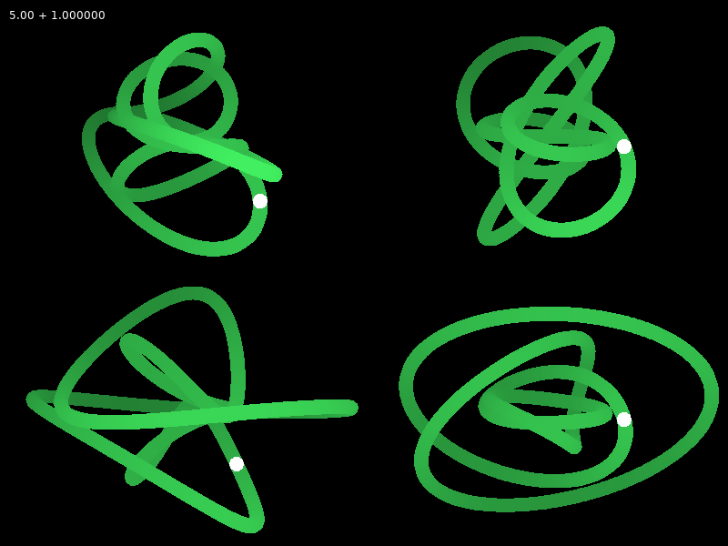
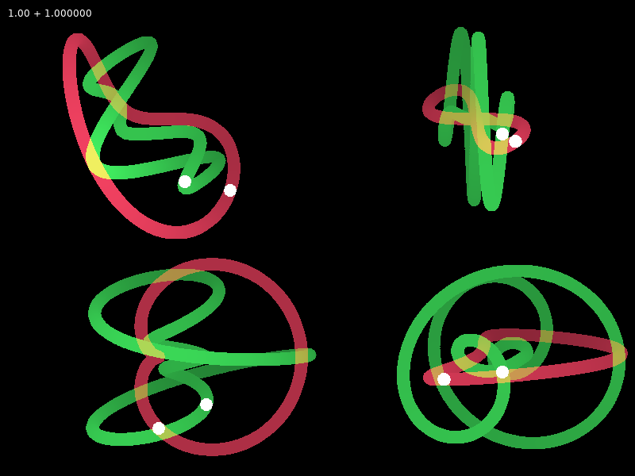
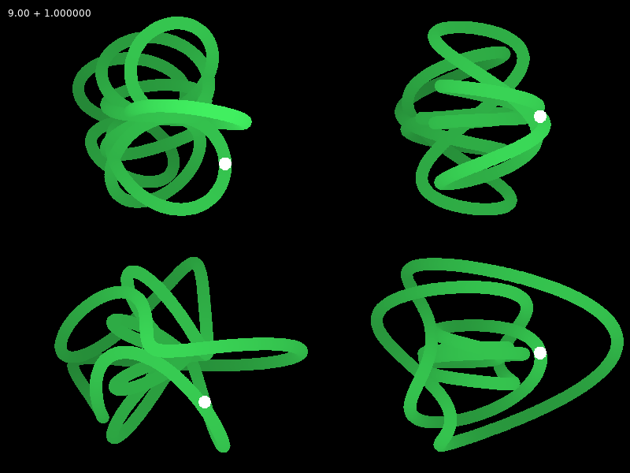
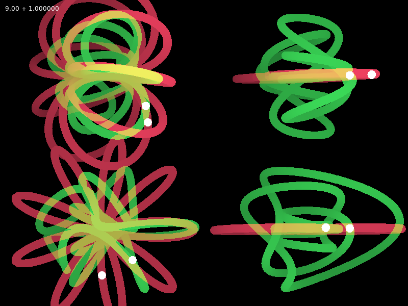
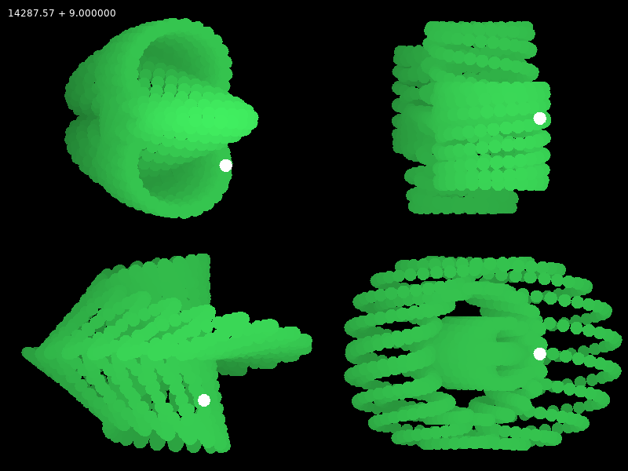
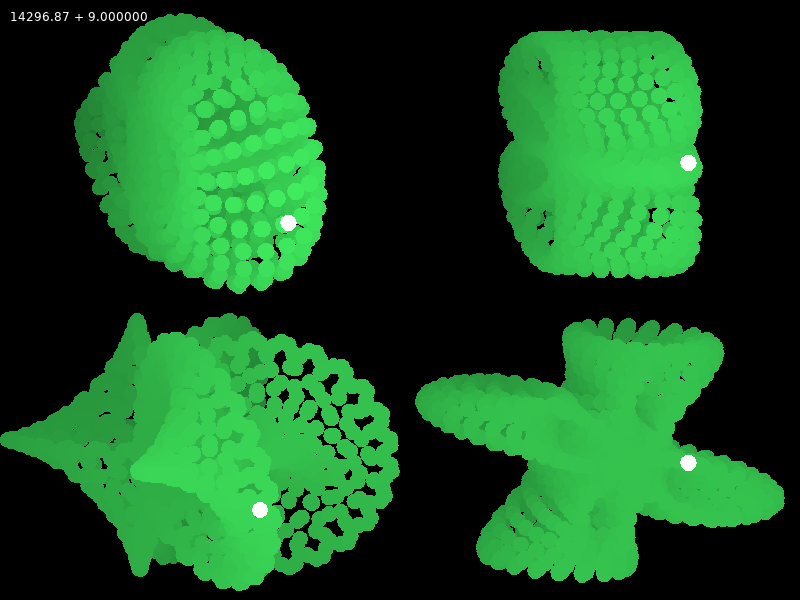

this is an attempt at tracing a spiral around a 4 dimensional meta-torus.
four different orthagonal projections are shown.

screenshots
-----------

keys
----
- `q` - show 3d torus (first two angles)
- `w` - invert spiraling direction
- `a`/`d` - move trace around (all) torus
- `up`/`down` - change spiralling speed
- `space` - toggle spiralling
- `shift` - invert spiralling (hold)
- `left`/`right` - snap to next integer spiral count

running
-------
this project is written for [love2d](https://love2d.org) in Lua.
you can install love2d from the website and run the project from the same directory with `love .`.
